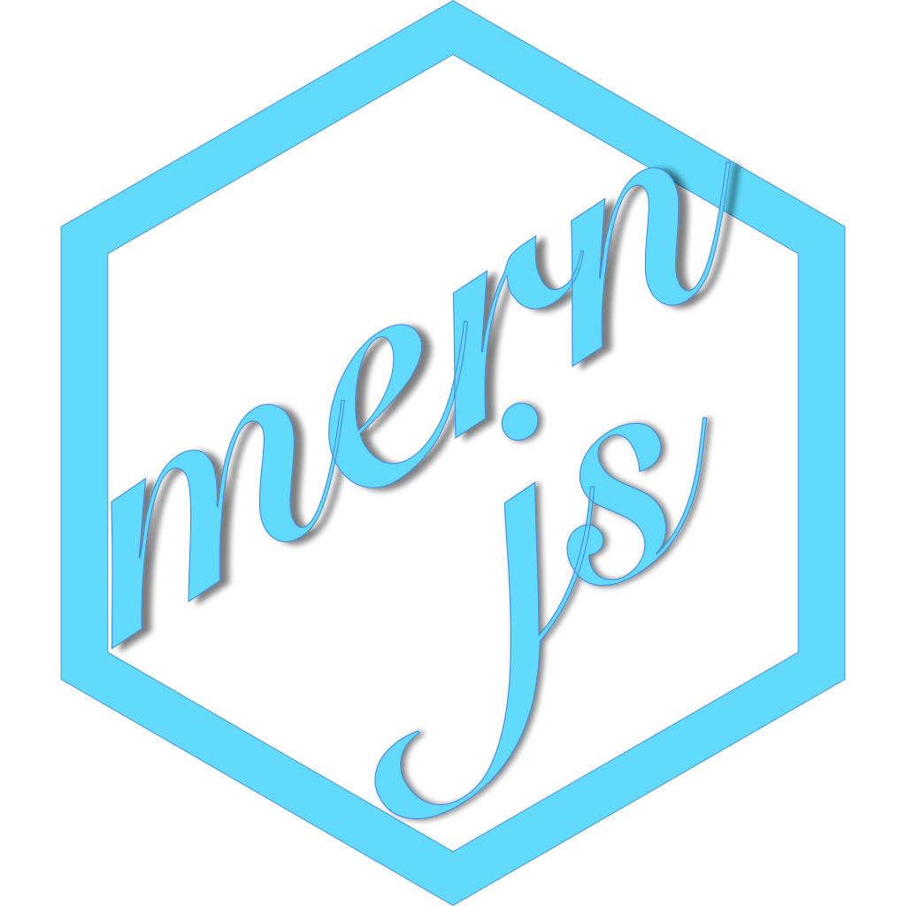

MERNjs is an open-source full-stack JavaScript solution, which provides a solid starting point for [MongoDB](http://www.mongodb.org/), [ExpressJS](http://expressjs.com/), [ReactJS](https://reactjs.org/) and [NodeJS](http://www.nodejs.org/) based applications. The idea is to solve the common issues with connecting those frameworks, build a robust framework to support daily development needs, and help developers use better practices while working with popular JavaScript components.

## Before You Begin

Before we begin, recommend to read about the basic building blocks that assemble a MERNjs application:

- MongoDB - Go through [MongoDB Official Website](http://mongodb.org/) and proceed to their [Official Manual](http://docs.mongodb.org/manual/), which should help you understand NoSQL and MongoDB better.
- Express - The best way to understand express is through its [Official Website](http://expressjs.com/), which has a [Getting Started](http://expressjs.com/starter/installing.html) guide, as well as an [ExpressJS](http://expressjs.com/en/guide/routing.html) guide for general express topics.
- ReactJS - React's [Official Website](http//facebook.github.io/react/) is a great starting point.
- Node.js - Start by going through [Node.js Official Website](http://nodejs.org/) which should get you going with the Node.js platform in no time.

## Prerequisites

Make sure we have installed all of the following prerequisites on our development machine:

- Git - [Download & Install Git](https://git-scm.com/downloads). OSX and Linux machines typically have this already installed.
- Node.js - [Download & Install Node.js](https://nodejs.org/en/download/) and the npm package manager. If you encounter any problems, you can also use this [GitHub Gist](https://gist.github.com/isaacs/579814) to install Node.js.
- MongoDB - [Download & Install MongoDB](http://www.mongodb.org/downloads), and make sure it's running on the default port (27017).

## Downloading MERNjs

Currently there is a single way that we can get the MERNjs boilerplate:

### Cloning The GitHub Repository

The recommended way to get MERNjs is to use git to directly clone the MERNjs repository:

```bash
$ git clone https://github.com/IamMohaiminul/MERNjs MERNjs
```

This will clone the latest version of the MERNjs repository to a **MERNjs** folder.

## Run our Application

To run our application follow this steps.

###### To install all dependencies

```sh
$ npm install
```

###### To start application

```sh
$ npm run build
$ npm start
```

###### To watch the live changes of application

```sh
// watch both server and client
$ npm run watch:client

// watch only server
$ npm run watch:server

// watch only client
$ npm run watch:client
```

###### To import the default admin user in db

```sh
$ mongoimport --db MERNjs --collection users --drop --file ./default.users.json
```

_Note: Please make sure our MongoDB is running._

Our application should run on port 3000 based on the environment configuration, so in our browser just go to [http://127.0.0.1:3000/](http://127.0.0.1:3000/) for Client App, [http://127.0.0.1:3000/admin](http://127.0.0.1:3000/admin) for Admin App & [http://127.0.0.1:3000/api](http://127.0.0.1:3000/api) for RESTful APIs.

_FYI, default admin user's email is `admin@mail.com` & password is `admin`._
