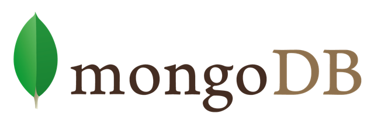

# MERNjs
MERNjs is a javascript scaffolding tool which makes it easy to build isomorphic apps using MongoBD, ExpressJS, ReactJS and NodeJS.




## Getting Started
To get started, first install all the necessary dependencies
```
> npm install
```
Start the development server (changes will now update live in browser)
```
> npm start
```
Start the development server with debug mode (changes will now update live in browser)
```
> npm run debug
```
*Note : Please make sure your MongoDB is running.*

To view your project, go to: [http://localhost:3000/](http://localhost:3000/)

To view your project's RESTful API, go to: [http://localhost:3000/api](http://localhost:3000/api)
